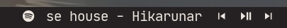

# polybar-spotify

This polybar module shows details regarding the currently playing song on Spotify. The unique feature of this module is that the text displayed is constantly scrolled to save space on the bar. This is something that is not found in other spotify modules I came across. Also, this module uses [playerctl](https://github.com/altdesktop/playerctl) to do all the work and hence, no >100 line scripts which do all the work themselves. Only one line to fetch the required metadata in the format that you like and another line to scroll the fetched text using [zscroll](https://github.com/noctuid/zscroll).




## Dependencies

- [playerctl](https://github.com/altdesktop/playerctl#installing) - To interface with Spotify and other MPRIS supporting players
- [zscroll](https://github.com/noctuid/zscroll#installation) - To scroll the fetched text

## Setup

- Make sure to go through and edit the required variables in [get_spotify_status.sh](get_spotify_status.sh) as shown below. Especially the `PARENT_BAR` one as without its correct value, toggling the play-pause symbol wouldn't work.
```sh
# The name of polybar bar which houses the main spotify module and the control modules.
PARENT_BAR="now-playing"

# Set the source audio player here.
# Players supporting the MPRIS spec are supported.
# Examples: spotify, vlc, chrome, mpv and others.
# Use `playerctld` to detect the latest player.
# See more here: https://github.com/altdesktop/playerctl/#selecting-players-to-control
PLAYER="playerctld"

# Format of the information displayed
# Eg. {{ artist }} - {{ album }} - {{ title }}
# See more attributes here: https://github.com/altdesktop/playerctl/#printing-properties-and-metadata
FORMAT="{{ title }} - {{ artist }}"
```
- Add the following in your polybar config.
Make sure to place the desired symbols for each module. You can get them from like [Font Awesome](https://fontawesome.com/cheatsheet) or [Nerd Fonts](https://www.nerdfonts.com/cheat-sheet).
```ini
[module/spotify]
type = custom/script
tail = true
; prefix symbol is shown before the text
format-prefix = "<prefix-symbol>"
format = <label>
exec = ~/.config/polybar/scripts/scroll_spotify_status.sh

[module/spotify-prev]
type = custom/script
exec = echo "<previous-song-symbol>"
format = <label>
click-left = playerctl previous -p spotify

[module/spotify-play-pause]
type = custom/ipc
hook-0 = echo "<playing-symbol>"
hook-1 = echo "<pause-symbol>"
initial = 1
click-left = playerctl play-pause -p spotify

[module/spotify-next]
type = custom/script
exec = echo "next-song-symbol"
format = <label>
click-left = playerctl next -p spotify
```

NOTE: The above given play-pause module requires IPC support enabled for its parent bar. That can be done by adding `enable-ipc = true` in your bar config.

## Customization

- Since I'm using [playerctl](https://github.com/altdesktop/playerctl), this script will work with any of the players supported by it. For instance, VLC, Chromium, Audacious, etc. It can even be used with multiple players running simultaneously. More info [here](https://github.com/altdesktop/playerctl#selecting-players-to-control).
- The format of the fetched metadata can be changed in [get_spotify_status.sh](get_spotify_status.sh). This line needs to be changed
  ```sh
  playerctl metadata spotify --format "{{ title }} - {{ artist }}"
  ```
  More details on what attributes can be fetched can be found [here](https://github.com/altdesktop/playerctl/#printing-properties-and-metadata).
- The scrolling text can be configured in [scroll_spotify_status.sh](scroll_spotify_status.sh). 
  - The length can be configured using `-l` and delay using `-d`.
  - The separators between the infinitely scrolling text can be configured using `--before-text` and `--after-text` parameters.  
  More info about zscroll's parameters can be found in `man zscroll`.    
